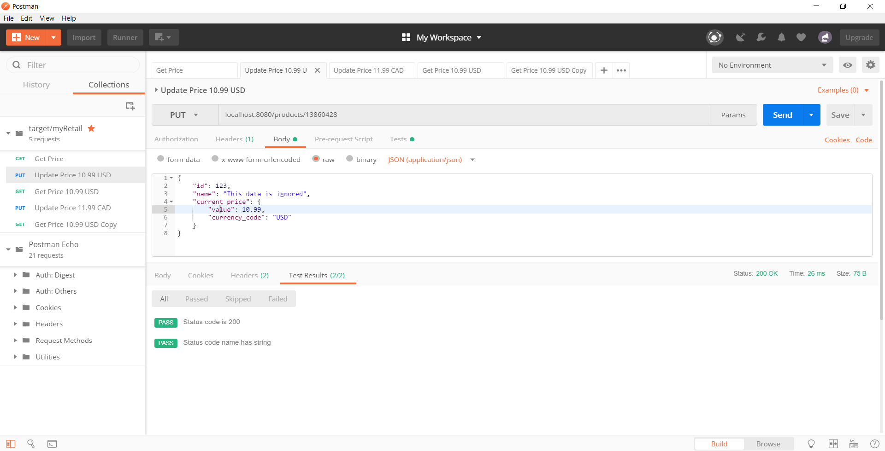
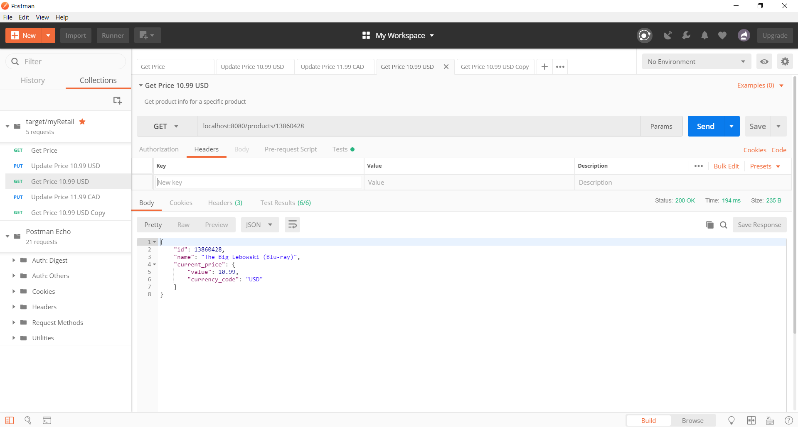

# myRetail
This is my implementation of the myRetail RESTful service case study

## Problem
Build an application that performs the following actions: 
* Responds to an HTTP GET request at /products/{id} and delivers product data as JSON (where {id} will be a number. 
  * Example product IDs: 15117729, 16483589, 16696652, 16752456, 15643793) 
  * Example response: {"id":13860428,"name":"The Big Lebowski (Blu-ray) (Widescreen)","current_price":{"value": 13.49,"currency_code":"USD"}}
* Performs an HTTP GET to retrieve the product name from an external API. (For this exercise the data will come from redsky.target.com, but let’s just pretend this is an internal resource hosted by myRetail) 
  * Example: http://redsky.target.com/v2/pdp/tcin/13860428?excludes=taxonomy,price,promotion,bulk_ship,rating_and_review_reviews,rating_and_review_statistics,question_answer_statistics
* Reads pricing information from a NoSQL data store and combines it with the product id and name from the HTTP request into a single response. 
* BONUS: Accepts an HTTP PUT request at the same path (/products/{id}), containing a JSON request body similar to the GET response, and updates the product’s price in the data store. 

## Implementation
### Technical Stack
1. Spring Boot
2. MongoDB
3. Maven
4. Postman

### Before Production
1. Are all use cases handled?
   - What is the business process for adding price data to the data store?
   - Do products need different pricing information for different countries?
2. What are the security requirements for the application?
   - Price adjustment should be restricted to privileged users
   - Had all users ought to have access to pricing information?

## Using the application
### Environment Setup
1. [Install Java 1.8](http://www.oracle.com/technetwork/java/javase/downloads/jdk8-downloads-2133151.html)
2. [Install Maven](https://maven.apache.org/install.html)
3. [Install MongoDB](https://docs.mongodb.com/manual/installation/)
4. [Install Postman](https://www.getpostman.com/docs/v6/postman/launching_postman/installation_and_updates)

### Install, Run, and Test
1. Clone this repository
2. Open the code in the IDE of your choice (I used IntelliJ)
   1. Install Maven dependencies
   2. Compile the code
   3. Run `mvn spring-boot:run`
6. Open Postman
   1. Import the collection provided in the repository
   2. Open the Runner dialog and run the collection
   3. Check test output
   
### Sample Test Output

